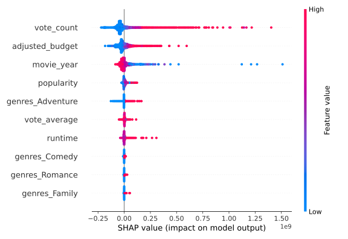
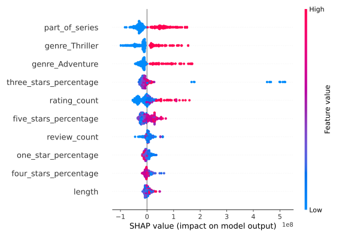
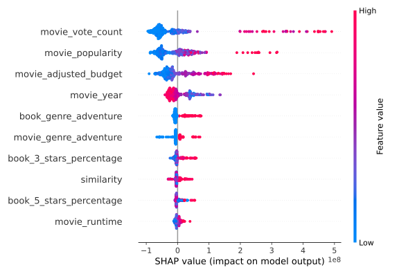

# Dear Director,

Being one of our favorite directors, it's truly a shame that so much time has passed since your last film. We've heard
that a lack of inspiration is weighing you down, so we've decided to offer our help. Imagine this: a packed theater,
audiences glued to their seats, so captivated by the movie that they forget about their popcorn, and critics raving
about your latest masterpiece. What if we told you that the missing puzzle piece for creating such a blockbuster might
already be gathering dust on millions of bookshelves across the world, waiting to be brought to life?
You must constantly get story ideas from all kinds of people, and we bet it gets exhausting with everyone thinking they
know what makes a great script. Instead of crafting a half hearted plot of our own, we have decided to dive deep into
the great stories that already exist in the timeless form of books. By adopting our ideas, your next film has the
potential to stand among the greatest in cinematic history.
Book-based movies have a unique power: they can tap into an existing fanbase, provide a blueprint for the adaptation,
and have a proven track record of yielding more successful movies compared to non-book-based movies. We will explore how
such films outperform their bookless counterparts and uncover the most important factors to catapult your movie to the
top. From genre choice to popularity to narrative fidelity, we will tell you what factors to consider to turn the book
you choose into the next blockbuster.
But let’s start with a little game. Test your knowledge on successful movies in this quiz below. Do you see any pattern
in the movies outperforming their counterparts?

## Movie Revenue Quiz

    <iframe src="assets/quizz.html" 
            width="100%" 
            height="720px" 
            style="border:none; max-width: 1200px;">
    </iframe>

We will come back to how we matched these pairs for the quiz, but for now all you need to know is that all the winners
here are based on books whereas the others are based on a poem, a short film and traditional film scripts. We hope that
with that we have made you curious enough to keep reading about the world of book adaptations.

## Let us introduce you to our dataset

The first and maybe also most important step for a good data analysis is of course finding the data. We were equipped
with a lot of data on movies, containing not only metadata about its production but also movie summaries from Wikipedia
and IMDB-Ratings. We combined this data with a book dataset that includes important information such as Goodreads
ratings (the most important platform for book reviews, comparable to the IMDB website), the length of the book, release
date, author etc. It also includes which books were adapted to movies, allowing both datasets to be combined.
The first thing to do when handling such a big dataset is cleaning up. We chose to focus on movies that have information
about both the revenue and budget of the movie, which already shrunk our dataset to about 9000 movies. Out of these
9000, about 10 % are based on a book. In our analysis we will compare the data of movies-based-on-books with
movies-not-based-on-books.
You might have noticed that having to say “a-movie-based-on-a-book” or “a-movie-not-based-on-a-book” every time is quite
a mouthful. We want to make your life as easy as possible and will therefore introduce you to our good friends (aka.
acronyms) Bob and Nob. Bobs are all movies that are Based-On-a-Book. Nobs are all movies that are
Not-Originated-from-a-Book.
When we talk about Bobs, do you have some examples in mind? Some of the most successful movies ever made, both in terms
of revenue and ratings, are the Lord of the Rings, and to no one's surprise they are part of our Bobs! Can you find them
in the graph below? Can you find any other of your favorite Bobs?

    <iframe src="assets/plots/searchable_bob_revenue_vs_rating_js.html" 
            width="100%" 
            height="500vh" 
            style="border:none; max-width: 1200px;">
    </iframe>

## Matching

First, one has to define what it means for a film to be successful, which proves much harder than initially assumed.
Realizing that a movie is successful is easy, deciding whether it is more successful than another one is quite the
opposite. Is a small-budget artsy movie more successful than yet another Hallmark Christmas movie with the most
predictable storyline? Is a movie with hundreds of 5 star reviews better than a movie with thousands of 3 star reviews?
As often in life, the easiest thing is to copy what other people are doing, which leads us to two metrics, box office
revenue and ratings.

Merging the two metrics would significantly impact the outcome of any analysis, depending on the method of combination.
As a director, we’re quite sure that for you it is all about the money, nobody can eat a five star rating..
To get a first impression on our data, we could look at the evolution of revenue over time for both Bobs and Nobs. When
talking about money over time, it is important to consider that some effects are simply caused by inflation. We have
therefore adjusted the revenue for inflation, using the US consumer price index. For all subsequent analysis we have
always used an inflation-adjusted scale for all money related things.

    <iframe src="assets/plots/adj_revenue_over_time_js.html" 
            width="100%" 
            height="450vh" 
            style="border:none; max-width: 1200px;">
    </iframe>

We can already see that while both revenues for Bobs and Nobs increase over time, Bobs have always made more money than
Nobs.
However, this simple analysis does not reliably show whether the observed trend is simply due to the Bobs being based on
books. When talking about money, we also have to consider how much was spent.

    <iframe src="assets/plots/adj_budget_over_time_js.html" 
            width="100%" 
            height="450vh" 
            style="border:none; max-width: 1200px;">
    </iframe>

So Bobs not only generated more revenue but were more expensive on average than Nobs. So what if we look at the profit
they made?

    <iframe src="assets/plots/adj_revenue_budget_over_time_js.html" 
            width="100%" 
            height="450vh" 
            style="border:none; max-width: 1200px;">
    </iframe>

That’s great to see! Bobs have made more profit on average than Nobs.

But this alone is probably not enough to convince you of directing a Bob. What if the effect is caused by so-called confounders? Maybe Bobs are outperforming Nobs because of the chosen genres? We want to convince you without a doubt that choosing a Bob for your next masterpiece is a good idea, so we should take care of these confounders first. 

In order to get more meaningful results we performed a matching analysis. The aim of this statistical method is to compare Bobs and Nobs with similar preconditions for achieving high box office revenue, thereby minimizing the impact of confounding factors. This necessitates the definition of what it means for two films to have similar preconditions to success. To make sure that we catch all important factors we not only fitted one but two models: linear regression and random forests. 
While we try to give you as much information as needed to understand our findings, we won’t bore you with any technical details of the models we used, we promise. As data analysts, it’s our job to handle the technical stuff so you don’t have to. 

Linear Regression tries to model the data by defining the impact of each variable on the outcome. As an example, if our data included the total number of cookies consumed during filming, this would probably have a very low impact on the box office revenue. The duration of the movie on the other hand will probably have some influence. Be it that longer movies seem to give more bang for the buck and thus attract more viewers, or that shorter movies can be played more often in cinemas. Deciding on which scenario is more important is where linear regression comes in. 

Linear regression is an easy to use and fast method to gain some insight into the dataset. However, as the name suggests, it can only capture linear relationships between our data and the revenue. To give you a more varied insight into our data we decided to additionally use random forests to extract feature importances and confirm our previous findings.

While the name “random decision forest” sounds spooky, its working principle is quite easy to understand. It consists of many different decision trees that are essentially interviewing the data. A decision tree might ask whether a movie has been produced in the US and depending on the answer it will then either try to identify in which other country this movie was produced, or move on to some other questions like the number of languages the movie was translated to. A tree will normally ask between 10 and 20 questions. Afterwards, every tree makes its own estimate of the revenue of the movie. Each tree tries to have the best estimate possible. Having many of these trees then allows the algorithm to check which questions are being asked the most often, which directly gives their impact on the prediction of the revenue. 

    <iframe src="assets/plots/regression.html" 
            width="50%" 
            height="500px" 
            style="border:none;">
    </iframe>
    <iframe src="assets/plots/random_forest_importances.html" 
            width="50%" 
            height="500px" 
            style="border:none;">
    </iframe>

In the linear regression plot you can see all features, out of the almost 50 we tested, that have significant p-values. Any points that are on the right side of the dashed line have a positive effect on the revenue prediction, on the left side the effect is negative. A high vote count seems to have the highest positive effect on the revenue, together with the adjusted budget. The popularity measure is a measure of how often the movie has been looked up lately on the IMDB website and has a positive impact as well. Surprisingly, the movie year has a negative effect on the revenue, meaning that if we isolate the effect of the release date, newer movies perform worse than older ones. We explain this to ourselves with the fact that nowadays there are a lot of bad movies (not from you of course) that make no profit at all, while in the past, movie making was more of an exclusive art form, where much less movies were made. So while there are a few great movies with a lot of revenue nowadays, there are even more really bad ones, leading the newer release years to have a negative effect on the revenue. 
In the plots derived from the random forest we can see that the vote count and budget is very important for the success of a movie. 
While both models are not perfect for the prediction of a movie's revenue, they still show a clear pattern of which parameters are important for a movie's success. 
Some of these features have a positive effect on the success of the movies and others have a negative effect. 

    <iframe src="assets/plots/movies_shap.svg" 
            style="border: none; width: 80%; height: 70vh; max-width: 1200px;">
    </iframe>

  

This plot visualizes the SHAP values derived from the Random Forest model for all movies. SHAP values are a widely used metric to understand how individual features influence predictions in machine learning models. While the plot might initially seem complex, it becomes easy to interpret with some guidance. Each dot represents a data point, and the colors indicate the magnitude of a specific feature's value. For example, in the case of budget, red dots (indicating a high budget) are associated with positive SHAP values, meaning they contribute positively to the prediction. Conversely, blue dots (representing low budgets) show a negative impact on the outcome. For binary features (features that can be answered with a yes or no question), such as genre, red dots (high value) indicate that a particular feature is present for a given data point. 

We can see that the SHAP values mostly agree with the results from the linear regression! This is a great sign and we can now use these findings to do the matching of our Bobs with Nobs that are the most similar in their preconditions for success. 

matching parameters

Since no two movies will have the same genres, runtimes, and ratings, the task of finding two identical movies is doomed from the get go. One way of avoiding this doom is to create a propensity score. Merriam-Webster defines Propensity as “an often intense natural inclination or preference”, in this case - a natural inclination to make heaps of money. This propensity score combines all important confounders to generate one feature on which movies can then be matched, a feature that measures their preconditions for success. Wait, why are we doing this again? Right, movies with the same preconditions can be matched and compared. We have already introduced you to some of these matches in the quiz at the beginning of our letter! 
Finally, let’s reap the fruits of our labor and see what results this produces. Out of 434 pairs of Bobs and Nobs, 58% of the time Bobs make more money. Could this result just be a statistical anomaly you might ask. Doing a statistical test shows that we can be 99.97% sure that Bobs generate higher revenues than Nobs. Enough of these percentages, what does this mean in the green? A Bob has an average revenue that is 10.7 million US-Dollars higher. 

    <iframe src="assets/plots/matches.html" 
            width="100%" 
            height="500vh" 
            style="border:none; max-width: 1200px;">
    </iframe>

## Analysing the Perfect Book for the Next Bob

Now that we have hopefully convinced you of doing a Bob for your next blockbuster, we should probably help you choose what to look for in the perfect book for a Bob. By now you are certainly familiar with our workflow: we first clean our data and then we fit both a linear regression and random forest model to our dataset to figure out which features are important. Do you expect a good book to make a good movie? 

    <iframe src="assets/plots/reg_books.html" 
            width="50%" 
            height="500px" 
            style="border:none;">
    </iframe>
    <iframe src="assets/plots/forest_books.html" 
            width="50%" 
            height="500px" 
            style="border:none;">
    </iframe>

    <iframe src="assets/plots/books_shap.svg" 
            style="border: none; width: 80%; height: 70vh; max-width: 1200px;">
    </iframe>

  

Overall, taking only the book features leads to a higher error in predictions and less of the variability in the dataset can be explained. So choosing a good book alone does not make a good movie yet. We are sure you are glad to hear that your expertise is still valuable and important to make the next masterpiece. However, with those two models we can still make some recommendations for your choice of book. 
Linear regression seems to not capture the influence of a high 3 star percentage in ratings for the book. If we look at the SHAP values of 3 star ratings we can see that a mediocre book (meaning a high percentage in 3 star ratings) makes for a bad movie. A high percentage in 5 star ratings on the other hand has a positive influence on the success of its Bob. Another important factor for success is the genre of the book. Some book genres seem to be more suitable for Bobs than others. We suggest you should choose either your favorite Adventures or Thrillers book to increase your chances of making a successful Bob. And last but not least, people tend to love sequels. Choosing a book that is part of a series will certainly increase your chances of making the next Lord of the Rings. 

## How to Make the perfect Book Adaptation

The first step of selecting the right book has been taken, but what now? Should your movie try to do some creative interpretation of the book or just follow it as closely as possible? Is it important that the overall feeling of the book is kept or can a change in scenery help distancing the movie from the book? 
Contrary to what has been done so far, this part cannot be derived by features like ratings, runtime or budget. To really have an idea of how much a director has changed the initial story, one has to watch the movie and read the book. This would be impossible to do as humans, and would still require copious amounts of time even on the fastest computers that exist. Luckily, Wikipedia exists. A place where thousands of contributors improve each other's work to perfection and beyond. With this we could identify a total of 392 stories where the book and movie summaries are available. Comparing these texts with an algorithm helps determine the similarity between them, this score can then be combined with the most important book and movie features from the earlier analysis. Once again, our dear friends random forests and linear regression, can now help in deciding how important this similarity is. It is also interesting to compare the most important features of movies with the most important features of books.

    <iframe src="assets/plots/reg_books_movies.html" 
            width="50%" 
            height="500px" 
            style="border:none;">
    </iframe>
    <iframe src="assets/plots/forest_books_movies.html" 
            width="50%" 
            height="500px" 
            style="border:none;">
    </iframe>

    <iframe src="assets/plots/books_movies_shap.svg" 
            style="border: none; width: 80%; height: 70vh; max-width: 1200px;">
    </iframe>

  

This analysis shows that in general a higher similarity is desirable. Features like movie budget and year, and whether the movie’s genres include “adventure” are still more important. When it comes to book features, they are all less important than similarity. This means that it is better to choose a book that translates well to the screen, rather than choosing one that is just popular.

## Multiple Adaptations of Books
In the quest of helping you decide what book to choose and general insights on how you should go about putting the written word on screen there is one treasure chest which we haven’t explored yet. There are some books such as “Frankenstein” and “Dracula” where there exist several dozens of movie adaptations. It goes without saying that not all of them achieved the same level of success. So let's try to understand what sets the best Bobs apart from their book siblings. For simplicity’s sake, films that were based on the same book will be called Bob siblings from now on. The most interesting features to look at are the ones you can act on before and during your next production. We selected the budget, runtime, release year, and similarity between the book and movie plot. Unfortunately, filtering for Bobs with siblings where all these features and the revenue (success metric) are known leaves us with relatively little data and the results ought to be taken with a grain of salt. But let's look at how we went about making the most of what we have at our disposal. First, we standardized the features and revenue for all films based on the same book. Following this step, positive feature values indicate that a film is above the mean compared to their siblings, while negative values suggest the opposite. The most successful siblings are therefore characterised by a positive revenue value after standardisation. Plotting the distribution of the other features for those top films gives an indication where they generally stand with respect to their siblings.

    <iframe src="assets/plots/siblings_plot.html" 
            width="100%" 
            height="550vh" 
            style="border:none; max-width: 1200px;">
    </iframe>

The small amount of data leaves us with a little dilemma. Including the Bobs with fewer siblings leaves us with more overall data but the individual families are less meaningful whereas only looking at big families drains our overall data even more. Nonetheless there are certain trends visible throughout all possible arrangements. The best performing movies tend to be longer, older and more similar to the book than their siblings. This is very good news as this allows you to express yourself without having to worry too much about your creation being too long. Furthermore you can focus on the filmographic aspects of the production as the plot is already well established by the chosen book. Lastly we would recommend to choose a book which hasn’t yet been adapted as your version will then forever be the oldest one available.

---

## Popularity of Movies vs Books

    <iframe src="assets/plots/popularity_over_time_js.html" 
            width="100%" 
            height="450vh" 
            style="border:none; max-width: 1200px;">
    </iframe>

